# Distributed OAuth2 Authorization Server (Provider) 🔐

[](LICENSE)
[](https://kubernetes.io/)
[](https://spring.io/projects/spring-boot)
[](https://www.mongodb.com/)
[](https://redpanda.com/)
[](https://redis.io/)

> **A production-grade OAuth2/OIDC authorization server** with hardware security key support (FIDO2/WebAuthn), cryptographic password integrity verification, event-driven architecture, and comprehensive observability.

---

## 🎯 Project Overview

This project implements a **distributed OAuth2/OIDC authorization server** designed for high-availability, security, and scalability. Built as a college project to demonstrate enterprise-grade architecture patterns, it incorporates cutting-edge security practices and event-driven architecture.

### Key Highlights

- 🔒 **Hardware Security Keys**: FIDO2/WebAuthn integration for passwordless authentication with YubiKey support
- 🛡️ **Cryptographic Integrity**: HMAC-based password integrity verification preventing database tampering
- 🌐 **Multi-Language Clients**: OAuth2 clients in Go, Python, and JavaScript with PKCE + nonce support
- 📨 **Event-Driven Architecture**: Decoupled mail/SMS/security event processing via Kafka streams
- 📊 **Full Observability**: Prometheus metrics, Grafana dashboards, Loki logs, Zipkin distributed tracing
- 🚀 **Cloud-Native**: Kubernetes deployment with HPA + KEDA autoscaling, Kong API Gateway
- ⚡ **High Performance**: Redis Stack caching + MongoDB for user data + ScyllaDB ready
- 🔐 **Advanced Security**: Device fingerprinting, account locking, rate limiting, security event audit trail
- 🏗️ **Microservices**: 11 independent services with dedicated Jenkins CI/CD pipelines
- 🔧 **gRPC Integration**: Isolated password hashing service using Argon2id

---

## 📋 Table of Contents

- [Architecture](#-architecture)
- [Security Features](#-security-features)
- [Technology Stack](#-technology-stack)
- [Multi-Language OAuth2 Clients](#-multi-language-oauth2-clients)
- [Event-Driven Architecture](#-event-driven-architecture)
- [Key Components](#-key-components)
- [Getting Started](#-getting-started)
- [Configuration](#-configuration)
- [Monitoring & Observability](#-monitoring--observability)
- [Kubernetes Deployment](#-kubernetes-deployment)
- [CI/CD Pipeline](#-cicd-pipeline)
- [Security Best Practices](#-security-best-practices)
- [Contributing](#-contributing)
- [License](#-license)

---

## 🔐 OAuth2 Authorization Flow

### Authorization Code Flow with PKCE

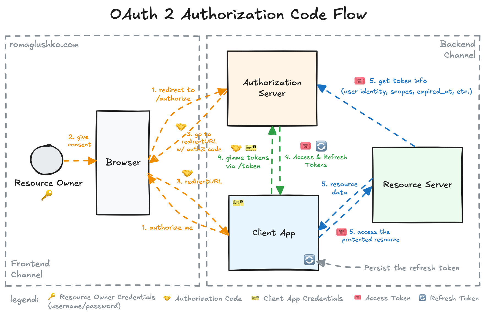
_Complete OAuth2 authorization code flow showing resource owner, browser, authorization server, client app, and resource server interactions_

**Flow Steps:**

1. **Redirect to Authorization:** Resource owner initiates login, browser redirects to authorization server
2. **Give Consent:** User authenticates and provides consent
3. **Authorization Code:** Authorization server returns authorization code via redirect URL
4. **Request Token:** Client app exchanges authorization code for access & refresh tokens
5. **Access & Refresh Tokens:** Authorization server issues tokens
6. **Request Resource:** Client uses access token to request protected resources
7. **Access Protected Resource:** Resource server validates token and returns data
8. **Persist Refresh Token:** Client stores refresh token for future use

### Simplified OAuth2 Flow

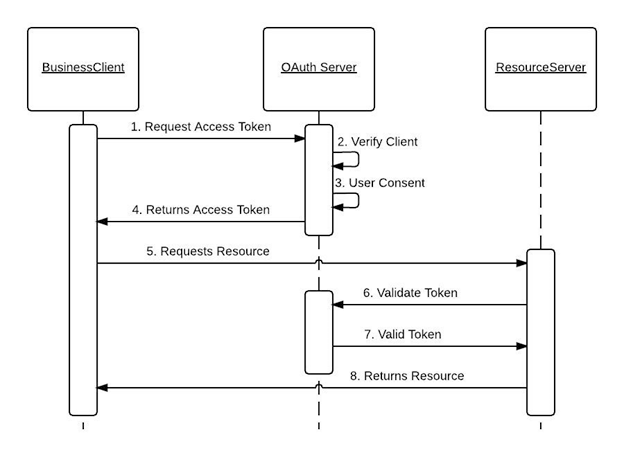
_Simplified view showing BusinessClient, OAuth Server, and ResourceServer interaction_

**Simplified Steps:**

1. **Request Access Token:** Business client requests token from OAuth server
2. **Verify Client:** OAuth server verifies client credentials
3. **User Consent:** User provides consent for authorization
4. **Returns Access Token:** OAuth server issues access token
5. **Requests Resource:** Client uses token to access resource server
6. **Validate Token:** Resource server validates token with OAuth server
7. **Valid Token:** OAuth server confirms token validity
8. **Returns Resource:** Resource server returns protected data

---

## 🏗️ Architecture

### System Architecture Overview

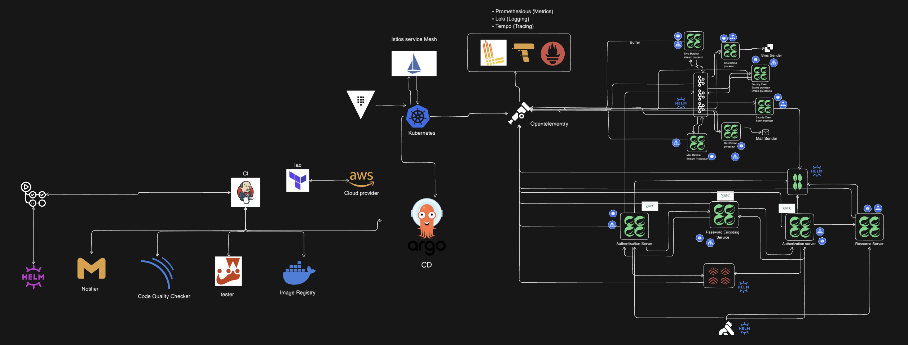

The system follows a microservices architecture with event-driven communication patterns, deployed on Kubernetes with comprehensive observability.

### High-Level Architecture

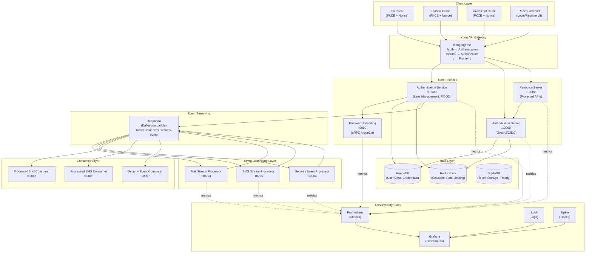

### Event-Driven Processing Flow

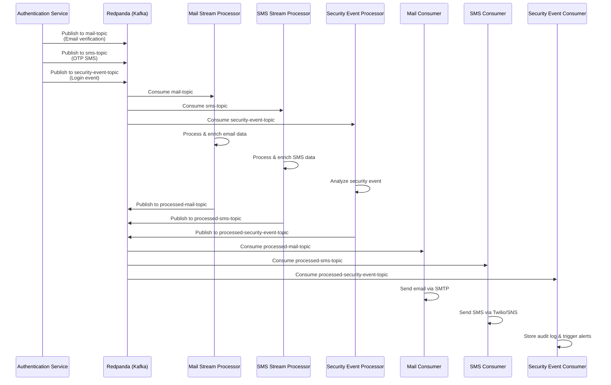

---

## 🔒 Security Features

### 1. **Cryptographic Password Integrity** 🛡️

Traditional password storage uses bcrypt/Argon2, but **this implementation adds HMAC-based integrity verification** to detect database tampering.

#### How It Works

```java
// SecurityIntegrity.java - Password storage with HMAC
@Data
public class SecurityIntegrity {
    private String hashedPassword;        // Argon2 hash
    private String integrityHmacKeyId;    // Key rotation support
    private String integrityHmac;         // HMAC(key, hashedPassword)
}
```

**Architecture:**

```
┌──────────────────────────────────────────────────────────────┐
│  Step 1: Password Registration                               │
│                                                               │
│  User Password ─────► gRPC Service (Separate Platform)       │
│                         │                                     │
│                         ▼                                     │
│                    Argon2 Hashing                             │
│                    (Memory: 64MB, Iterations: 3)              │
│                         │                                     │
│                         ▼                                     │
│                  hashedPassword                               │
│                         │                                     │
│                         ▼                                     │
│  OAuth2 Service ◄───  Returns hash                            │
│       │                                                       │
│       ▼                                                       │
│  Fetch HMAC Key from Vault (rotates every 30 days)           │
│       │                                                       │
│       ▼                                                       │
│  HMAC-SHA256(key, hashedPassword) ──► Store in MongoDB       │
│                                                               │
│  MongoDB Document:                                            │
│  {                                                            │
│    "hashedPassword": "argon2$v=19$...",                       │
│    "integrityHmacKeyId": "key_version_42",                    │
│    "integrityHmac": "a3f8c9d2..."                             │
│  }                                                            │
└──────────────────────────────────────────────────────────────┘

┌──────────────────────────────────────────────────────────────┐
│  Step 2: Password Verification (Login)                       │
│                                                               │
│  User Login ──► Fetch from MongoDB                            │
│                     │                                         │
│                     ▼                                         │
│  Verify Integrity:                                            │
│  1. Fetch HMAC key from Vault (using integrityHmacKeyId)      │
│  2. Recompute: HMAC-SHA256(key, hashedPassword)               │
│  3. Compare with stored integrityHmac                         │
│                     │                                         │
│                     ├──► If Match: ✅ Proceed to verify       │
│                     │                 password with gRPC      │
│                     │                                         │
│                     └──► If Mismatch: ❌ DATABASE TAMPERED    │
│                              │                                │
│                              ▼                                │
│                        Log security event                     │
│                        Lock account                           │
│                        Alert security team                    │
└──────────────────────────────────────────────────────────────┘
```

**Why This Matters:**

- ✅ Detects if an attacker modifies the database directly
- ✅ Prevents privilege escalation via database manipulation
- ✅ Keys rotate automatically via Vault (30-day cycle)
- ✅ Separate gRPC service ensures password hashing is isolated

---

### 2. **FIDO2/WebAuthn Hardware Security Keys** 🔑

Full support for passwordless authentication using YubiKey, Touch ID, Windows Hello, and other FIDO2 authenticators.

#### Implementation

```java
// FidoCredential.java - Stores public key and metadata
@Data
@Builder
public class FidoCredential {
    @Field("credential_id")
    private ByteArray credentialId;      // Unique credential identifier

    @Field("user_handle")
    private ByteArray userHandle;        // Links to user account

    @Field("public_key")
    private ByteArray publicKey;         // ECDSA P-256 public key

    @Field("signature_count")
    private long signatureCount;         // Prevents replay attacks

    @Field("name")
    private String name;                 // "My YubiKey 5C"

    @Field("integrity_hmac_key_id")
    private String integrityHmacKeyId;   // For key rotation

    @Field("integrity_hmac")
    private String integrityHmac;        // HMAC(key, publicKey)
}
```

**Registration Flow:**

```
┌────────────────────────────────────────────────────────────────┐
│  1. User Requests Passkey Registration                         │
│     POST /api/webauthn/register/start                          │
│                                                                 │
│  2. Server generates challenge                                 │
│     ┌─────────────────────────────────────┐                    │
│     │ Challenge: random 32-byte value     │                    │
│     │ User ID: user handle                │                    │
│     │ RP ID: oauth.example.com            │                    │
│     │ Algorithms: ES256, RS256            │                    │
│     └─────────────────────────────────────┘                    │
│                                                                 │
│  3. Browser/Client calls navigator.credentials.create()        │
│     User touches YubiKey                                        │
│                                                                 │
│  4. Client sends attestation                                   │
│     POST /api/webauthn/register/finish                         │
│     {                                                           │
│       "credentialId": "base64...",                              │
│       "publicKey": "base64...",                                 │
│       "attestation": {...}                                      │
│     }                                                           │
│                                                                 │
│  5. Server verifies and stores                                 │
│     • Validate attestation signature                           │
│     • Extract public key                                       │
│     • Generate HMAC for integrity                              │
│     • Store in MongoDB                                         │
└────────────────────────────────────────────────────────────────┘
```

**Authentication Flow:**

```
┌────────────────────────────────────────────────────────────────┐
│  1. User clicks "Sign in with Passkey"                         │
│     POST /api/webauthn/authenticate/start                      │
│                                                                 │
│  2. Server fetches stored credential                           │
│     • Verify HMAC integrity of stored public key               │
│     • Generate new challenge                                   │
│                                                                 │
│  3. Client calls navigator.credentials.get()                   │
│     User touches YubiKey                                        │
│                                                                 │
│  4. Client sends assertion                                     │
│     POST /api/webauthn/authenticate/finish                     │
│     {                                                           │
│       "credentialId": "base64...",                              │
│       "signature": "base64...",                                 │
│       "authenticatorData": "base64..."                          │
│     }                                                           │
│                                                                 │
│  5. Server verifies signature                                  │
│     • Increment signature counter (prevent replay)             │
│     • Verify signature using stored public key                 │
│     • Issue OAuth2 tokens                                      │
└────────────────────────────────────────────────────────────────┘
```

**Security Properties:**

- ✅ **Phishing-resistant**: Cryptographically bound to domain
- ✅ **Replay-protected**: Signature counter increments
- ✅ **Tamper-evident**: HMAC integrity on public keys
- ✅ **User presence**: Requires physical touch

---

### 3. **OAuth2 Security Enhancements** 🔐

#### PKCE (Proof Key for Code Exchange)

Prevents authorization code interception attacks in public clients.

```
Authorization Request:
  code_challenge = BASE64URL(SHA256(code_verifier))
  code_challenge_method = S256

Token Request:
  code_verifier = original_random_value

Server validates:
  SHA256(code_verifier) == code_challenge
```

#### Nonce (Prevents Replay Attacks)

```
Authorization Request:
  nonce = random_value_123

ID Token (JWT):
  {
    "nonce": "random_value_123",
    "iat": 1738789200
  }

Client validates nonce matches original request.
```

---

### 4. **Device Fingerprinting & Anomaly Detection** 🖥️

```java
// SecurityEvent.java - Audit trail for security events
@Data
@Builder
public class SecurityEvent {
    private ObjectId id;
    private ObjectId user;
    private String deviceHashKeyId;     // Key ID for HMAC rotation
    private String deviceHash;          // HMAC(key, deviceFingerprint)
    private String ipAddress;
    private Event event;                // LOGIN, FAILED_LOGIN, PASSKEY_ADDED
    private String message;
    private Instant createdAt;
}
```

**Device Fingerprinting:**

```
Device Fingerprint = SHA256(
    User-Agent +
    Accept-Language +
    Screen Resolution +
    Timezone +
    Canvas Hash +
    WebGL Hash
)

Stored as: HMAC(vault_key, fingerprint)
```

**Anomaly Detection:**

```java
// User.java - Track known devices and lock suspicious activity
private List<String> knownDeviceHashes;
private boolean isAccountLocked;
private int numberOfInitiatedOperations;
private LocalDateTime lockingTime;
```

**Flow:**

```
Login Attempt
    ↓
Generate Device Hash
    ↓
Check if hash in knownDeviceHashes
    ↓
    ├─► Known Device: Allow
    │
    └─► Unknown Device:
            ├─► Send email verification
            ├─► Log SecurityEvent to Kafka
            ├─► Require MFA (TOTP/Passkey)
            └─► Add to knownDeviceHashes if verified
```

---

### 5. **Key Management with HashiCorp Vault** 🗝️

#### RSA Key Rotation for JWT Signing

```
┌─────────────────────────────────────────────────────────────┐
│  Vault Secrets Engine: Transit                              │
│                                                              │
│  Key: oauth2-jwt-signing                                    │
│  Type: RSA-4096                                              │
│  Auto-Rotation: Every 30 days                                │
│                                                              │
│  Versions:                                                   │
│    • Version 1: 2024-12-01 (archived)                        │
│    • Version 2: 2025-01-01 (active signing)                  │
│    • Version 3: 2025-02-01 (active signing + verification)   │
│                                                              │
│  Old tokens signed with v2 still verify with v2 public key   │
└─────────────────────────────────────────────────────────────┘
```

**Implementation:**

```java
// Fetch current signing key
VaultResponse response = vaultTemplate.read("transit/keys/oauth2-jwt-signing");
String publicKeyPEM = response.getData().get("latest_version");

// Sign JWT
String jwt = Jwts.builder()
    .setSubject(username)
    .signWith(vaultPrivateKey)  // Vault signs internally
    .compact();

// Verification uses JWKS endpoint
GET /.well-known/jwks.json
{
  "keys": [
    {
      "kid": "vault-v3",
      "kty": "RSA",
      "use": "sig",
      "n": "base64...",
      "e": "AQAB"
    }
  ]
}
```

#### HMAC Keys for Integrity Verification

```
┌─────────────────────────────────────────────────────────────┐
│  Vault KV Secrets Engine v2                                 │
│                                                              │
│  Path: secret/data/hmac-keys                                 │
│                                                              │
│  Keys:                                                       │
│    password-integrity-key-42:  "base64_encoded_secret"       │
│    device-hash-key-42:         "base64_encoded_secret"       │
│    fido-pubkey-integrity-42:   "base64_encoded_secret"       │
│                                                              │
│  Rotation Policy: 30 days                                    │
│  Access: OAuth2 service role only                            │
└─────────────────────────────────────────────────────────────┘
```

**MongoDB Storage Pattern:**

```json
{
  "_id": ObjectId("..."),
  "username": "alice@example.com",
  "security": {
    "hashedPassword": "argon2$v=19$m=65536...",
    "integrityHmacKeyId": "password-integrity-key-42",
    "integrityHmac": "a3f8c9d2e1b4f5a6..."
  },
  "fidoCredential": {
    "publicKey": "base64_encoded_ecdsa_pubkey",
    "integrityHmacKeyId": "fido-pubkey-integrity-42",
    "integrityHmac": "f9e8d7c6b5a4..."
  }
}
```

**Benefits:**

- ✅ Centralized secret management
- ✅ Automated key rotation (zero-downtime)
- ✅ Audit trail of all key access
- ✅ Prevents hardcoded secrets in code

---

### 6. **Separate gRPC Service for Password Hashing** 🔧

To ensure **defense in depth**, password hashing is isolated in a dedicated microservice.

**Architecture:**

```
┌──────────────────────────────────────────────────────────────┐
│  OAuth2 Service (Spring Boot)                                │
│                                                               │
│  POST /api/auth/register                                      │
│  {                                                            │
│    "username": "alice@example.com",                           │
│    "password": "SecureP@ssw0rd!"                              │
│  }                                                            │
│                                                               │
│  ↓ Sends password to gRPC service                             │
│                                                               │
└────────────────────┬──────────────────────────────────────────┘
                     │
                     │ gRPC Call (mTLS encrypted)
                     │
                     ▼
┌──────────────────────────────────────────────────────────────┐
│  Password Hashing Service (Go/Java)                          │
│                                                               │
│  service PasswordHasher {                                     │
│    rpc HashPassword(PasswordRequest)                          │
│        returns (PasswordResponse);                            │
│                                                               │
│    rpc VerifyPassword(VerifyRequest)                          │
│        returns (VerifyResponse);                              │
│  }                                                            │
│                                                               │
│  Implementation:                                              │
│    • Argon2id (Memory: 64MB, Iterations: 3, Parallelism: 4)  │
│    • Salt: 16 bytes (random per password)                     │
│    • Output: 32 bytes                                         │
│                                                               │
│  Returns: "argon2$v=19$m=65536,t=3,p=4$base64salt$base64hash" │
└──────────────────────────────────────────────────────────────┘
```

**Why Separate Service?**

| Benefit                | Explanation                                                                                                                             |
| ---------------------- | --------------------------------------------------------------------------------------------------------------------------------------- |
| **Resource Isolation** | Password hashing is CPU-intensive (Argon2 uses 64MB RAM per hash). Separate service prevents it from starving OAuth2 API threads.       |
| **Horizontal Scaling** | Can scale password hashing pods independently (e.g., 10 OAuth2 pods, 3 hashing pods).                                                   |
| **Security Boundary**  | Plaintext passwords never touch OAuth2 service memory. gRPC service can run in a separate security zone with stricter network policies. |
| **Technology Choice**  | Can use Go/Rust for faster Argon2 implementation while keeping OAuth2 in Java/Spring.                                                   |
| **Audit Trail**        | All password operations logged separately for compliance.                                                                               |

**gRPC Protocol Definition:**

```protobuf
syntax = "proto3";

package auth;

service PasswordHasher {
  // Hash a plaintext password
  rpc HashPassword(HashPasswordRequest) returns (HashPasswordResponse);

  // Verify password against hash
  rpc VerifyPassword(VerifyPasswordRequest) returns (VerifyPasswordResponse);
}

message HashPasswordRequest {
  string password = 1;
}

message HashPasswordResponse {
  string hashed_password = 1;
  string algorithm_info = 2;  // "argon2id(m=64MB,t=3,p=4)"
}

message VerifyPasswordRequest {
  string password = 1;
  string hashed_password = 2;
}

message VerifyPasswordResponse {
  bool is_valid = 1;
  bool needs_rehash = 2;  // If params changed (e.g., upgraded to 128MB)
}
```

---

## 💻 Technology Stack

### Core Services

| Component                 | Technology                  | Version | Purpose                                          |
| ------------------------- | --------------------------- | ------- | ------------------------------------------------ |
| **Authentication Server** | Spring Boot                 | 3.2+    | User management, FIDO2/WebAuthn, device tracking |
| **Authorization Server**  | Spring Boot                 | 3.2+    | OAuth2/OIDC authorization server (RFC 6749)      |
| **Resource Server**       | Spring Boot                 | 3.2+    | Protected API resources                          |
| **Password Encoding**     | Spring Boot + gRPC          | 3.2+    | Argon2id hashing (isolated microservice)         |
| **Mail Stream Processor** | Spring Boot + Kafka Streams | 3.2+    | Process and enrich email events                  |
| **SMS Stream Processor**  | Spring Boot + Kafka Streams | 3.2+    | Process and enrich SMS events                    |
| **Security Event Proc.**  | Spring Boot + Kafka Streams | 3.2+    | Analyze and enrich security events               |
| **Mail Consumer**         | Spring Boot + Kafka         | 3.2+    | Send processed emails via SMTP                   |
| **SMS Consumer**          | Spring Boot + Kafka         | 3.2+    | Send processed SMS via Twilio/SNS                |
| **Security Event Cons.**  | Spring Boot + Kafka         | 3.2+    | Store audit logs and trigger alerts              |
| **Frontend**              | React + TypeScript          | 18+     | Login/Register UI with FIDO2 support             |

### Data Stores

| Component         | Technology  | Version | Purpose                                         |
| ----------------- | ----------- | ------- | ----------------------------------------------- |
| **User Database** | MongoDB     | 7.0+    | User profiles, credentials, FIDO2 keys, devices |
| **Session Cache** | Redis Stack | latest  | Session data, rate limiting counters, OTP cache |
| **Token Store**   | ScyllaDB    | 5.4+    | OAuth tokens (configured, ready for production) |

### Event Streaming

| Component          | Technology | Version | Purpose                                              |
| ------------------ | ---------- | ------- | ---------------------------------------------------- |
| **Message Broker** | Redpanda   | 23.3+   | Kafka-compatible event streaming (mail, SMS, events) |

### Infrastructure

| Component             | Technology | Purpose                                   |
| --------------------- | ---------- | ----------------------------------------- |
| **Orchestration**     | Kubernetes | 1.28+ container orchestration             |
| **API Gateway**       | Kong       | Ingress routing, rate limiting            |
| **Autoscaling**       | HPA + KEDA | CPU-based and Kafka lag-based autoscaling |
| **Container Runtime** | Docker     | 24.0+ containerization                    |

### Observability

| Component         | Technology | Purpose                               |
| ----------------- | ---------- | ------------------------------------- |
| **Metrics**       | Prometheus | Time-series metrics from all services |
| **Logs**          | Loki       | Centralized logging                   |
| **Traces**        | Zipkin     | Distributed tracing                   |
| **Visualization** | Grafana    | Dashboards for metrics, logs, traces  |

### CI/CD

| Component              | Technology | Purpose                                     |
| ---------------------- | ---------- | ------------------------------------------- |
| **Source Control**     | Git        | Version control                             |
| **CI Pipeline**        | Jenkins    | Build, test, containerize (11 Jenkinsfiles) |
| **Container Registry** | Docker Hub | Image storage                               |
| **Deployment**         | kubectl    | Manual Kubernetes deployment                |

---

## 🌐 Multi-Language OAuth2 Clients

The project includes production-ready OAuth2 clients in **Go**, **Python**, and **JavaScript**, all implementing PKCE (Proof Key for Code Exchange) and nonce validation for enhanced security.

### Go Client

**Location:** [`goClient/main.go`](file:///Users/rahulgupta/Desktop/distributedSecurity/goClient/main.go)

**Features:**

- OIDC Discovery for automatic endpoint configuration
- PKCE with S256 challenge method
- Nonce validation to prevent replay attacks
- State parameter for CSRF protection
- Session management with HTTP-only cookies

**Key Implementation:**

```go
// PKCE Challenge Generation
func generateChallenge(verifier string) string {
    h := sha256.New()
    h.Write([]byte(verifier))
    return base64.RawURLEncoding.EncodeToString(h.Sum(nil))
}

// Authorization Request with PKCE + Nonce
func handleLogin(w http.ResponseWriter, r *http.Request) {
    state := generateRandom(32)
    nonce := generateRandom(32)
    verifier := generateRandom(32)
    challenge := generateChallenge(verifier)

    setCookie(w, "go_state", state)
    setCookie(w, "go_nonce", nonce)
    setCookie(w, "go_cv", verifier)

    url := oauthConfig.AuthCodeURL(state,
        oauth2.AccessTypeOffline,
        oauth2.SetAuthURLParam("code_challenge", challenge),
        oauth2.SetAuthURLParam("code_challenge_method", "S256"),
        oidc.Nonce(nonce),
    )
    http.Redirect(w, r, url, http.StatusFound)
}

// Token Exchange with Verifier
func handleCallback(w http.ResponseWriter, r *http.Request) {
    code := r.URL.Query().Get("code")
    cvCookie, _ := r.Cookie("go_cv")

    token, err := oauthConfig.Exchange(ctx, code,
        oauth2.VerifierOption(cvCookie.Value))

    // Verify ID Token and Nonce
    rawIDToken, _ := token.Extra("id_token").(string)
    verifier := provider.Verifier(&oidc.Config{ClientID: oauthConfig.ClientID})
    idToken, _ := verifier.Verify(ctx, rawIDToken)

    nonceCookie, _ := r.Cookie("go_nonce")
    if idToken.Nonce != nonceCookie.Value {
        http.Error(w, "Nonce mismatch", http.StatusBadRequest)
        return
    }
}
```

**Run:**

```bash
cd goClient
go run main.go
# Visit http://127.0.0.1:7800
```

---

### Python Client

**Location:** [`pythonClient/main.py`](file:///Users/rahulgupta/Desktop/distributedSecurity/pythonClient/main.py)

**Features:**

- FastAPI framework with Authlib integration
- Automatic PKCE with S256 method
- OIDC discovery via `.well-known/openid-configuration`
- Session middleware for user state
- ID token parsing and validation

**Key Implementation:**

```python
from authlib.integrations.starlette_client import OAuth

oauth = OAuth()
oauth.register(
    name='my_auth_server',
    client_id=os.getenv("CLIENT_ID"),
    client_secret=os.getenv("CLIENT_SECRET"),
    server_metadata_url=f'{os.getenv("ISSUER_URL")}/.well-known/openid-configuration',
    client_kwargs={
        'scope': 'openid profile read',
        'code_challenge_method': 'S256'  # Enable PKCE
    },
)

@app.get("/login")
async def login(request: Request):
    redirect_uri = os.getenv("REDIRECT_URI")
    return await oauth.my_auth_server.authorize_redirect(request, redirect_uri)

@app.get("/code/callback")
async def callback(request: Request):
    token = await oauth.my_auth_server.authorize_access_token(request)
    user = oauth.my_auth_server.parse_id_token(request, token)
    request.session['user'] = dict(user)
    return RedirectResponse(url='/')
```

**Run:**

```bash
cd pythonClient
uv run uvicorn main:app --host 127.0.0.1 --port 7700
# Visit http://127.0.0.1:7700
```

---

### JavaScript Client

**Location:** [`jsClient/index.js`](file:///Users/rahulgupta/Desktop/distributedSecurity/jsClient/index.js)

**Features:**

- Express.js with `openid-client` library
- OIDC Issuer discovery
- PKCE code verifier and challenge generation
- Nonce and state validation
- Express session management

**Key Implementation:**

```javascript
const { Issuer, generators } = require("openid-client");

// Initialize OpenID Client
async function initClient() {
  const issuer = await Issuer.discover(process.env.ISSUER_URL);
  client = new issuer.Client({
    client_id: process.env.CLIENT_ID,
    client_secret: process.env.CLIENT_SECRET,
    redirect_uris: [process.env.REDIRECT_URI],
    response_types: ["code"],
  });
}

app.get("/login", (req, res) => {
  const nonce = generators.nonce();
  const state = generators.state();
  const code_verifier = generators.codeVerifier();
  const code_challenge = generators.codeChallenge(code_verifier);

  req.session.nonce = nonce;
  req.session.state = state;
  req.session.code_verifier = code_verifier;

  const authUrl = client.authorizationUrl({
    scope: "openid profile read",
    state,
    nonce,
    code_challenge,
    code_challenge_method: "S256",
  });

  res.redirect(authUrl);
});

app.get("/code/callback", async (req, res) => {
  const params = client.callbackParams(req);
  const tokenSet = await client.callback(process.env.REDIRECT_URI, params, {
    nonce: req.session.nonce,
    state: req.session.state,
    code_verifier: req.session.code_verifier,
  });

  req.session.user = tokenSet.claims();
  res.redirect("/");
});
```

**Run:**

```bash
cd jsClient
pnpm install
node index.js
# Visit http://localhost:6000
```

---

### Client Comparison

| Feature                | Go Client | Python Client | JavaScript Client |
| ---------------------- | --------- | ------------- | ----------------- |
| **PKCE Support**       | ✅ S256   | ✅ S256       | ✅ S256           |
| **Nonce Validation**   | ✅ Manual | ✅ Automatic  | ✅ Automatic      |
| **State Validation**   | ✅ Manual | ✅ Automatic  | ✅ Automatic      |
| **OIDC Discovery**     | ✅        | ✅            | ✅                |
| **ID Token Parsing**   | ✅ Manual | ✅ Automatic  | ✅ Automatic      |
| **Session Management** | Cookies   | Middleware    | Express Session   |
| **Framework**          | net/http  | FastAPI       | Express.js        |

---

## 📨 Event-Driven Architecture

The system uses a **decoupled event-driven architecture** for mail, SMS, and security event processing. This ensures high throughput, fault tolerance, and independent scaling of processing components.

### Architecture Pattern

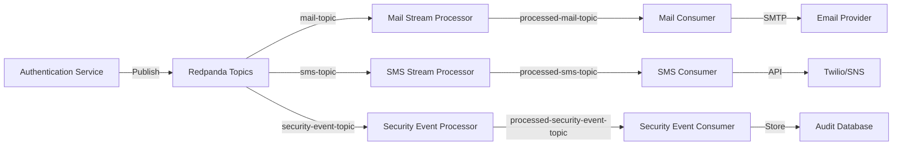

### Kafka Topics

| Topic                            | Producer                 | Consumer                        | Purpose                              |
| -------------------------------- | ------------------------ | ------------------------------- | ------------------------------------ |
| `mail-topic`                     | Authentication Service   | Mail Stream Processor           | Raw email events (verification, OTP) |
| `sms-topic`                      | Authentication Service   | SMS Stream Processor            | Raw SMS events (OTP, alerts)         |
| `security-event-topic`           | Authentication Service   | Security Event Stream Processor | Security events (login, FIDO2, etc.) |
| `processed-mail-topic`           | Mail Stream Processor    | Processed Mail Consumer         | Enriched emails ready to send        |
| `processed-sms-topic`            | SMS Stream Processor     | Processed SMS Consumer          | Enriched SMS ready to send           |
| `processed-security-event-topic` | Security Event Processor | Security Event Consumer         | Analyzed events ready for audit log  |

### Stream Processors

**Purpose:** Transform and enrich raw events before consumption.

**Example - Mail Stream Processor:**

- Consumes from `mail-topic`
- Enriches with user details, templates, localization
- Validates email addresses
- Publishes to `processed-mail-topic`

**Scaling:** KEDA autoscaling based on Kafka lag (threshold: 10 messages)

### Consumers

**Purpose:** Execute final actions (send email, send SMS, store audit log).

**Example - Mail Consumer:**

- Consumes from `processed-mail-topic`
- Sends email via SMTP (Gmail, SendGrid, etc.)
- Handles retries and dead-letter queue
- Logs delivery status

**Scaling:** KEDA autoscaling based on Kafka lag

### Security Event Types

From [`Event.java`](file:///Users/rahulgupta/Desktop/distributedSecurity/common/src/main/java/one/org/security/common/enums/Event.java):

```java
public enum Event {
    REGISTER,
    LOGIN_SUCCESS,
    LOGIN_FAIL,
    QR_LOGIN_SUCCESS,
    QR_LOGIN_FAIL,
    FIDO_REGISTER_SUCCESS,
    FIDO_REGISTER_FAIL,
    FIDO_LOGIN_SUCCESS,
    FIDO_LOGIN_FAIL,
    FORGET_PASSWORD_SUCCESS,
    FORGET_PASSWORD_FAIL,
    FORGET_PASSWORD_INITIATED,
    PASSWORD_CHANGED,
    BACKUP_EMAIL_VERIFIED,
    PHONE_NUMBER_VERIFIED,
    ACCOUNT_LOCKED,
    LOGOUT,
    ACCOUNT_DELETED,
    AUTHERIZED_CLIENT,
    CLIENT_ACCOUNT_CREATED,
    CLIENT_ACCOUNT_DELETED
}
```

### Benefits

| Benefit                   | Explanation                                                 |
| ------------------------- | ----------------------------------------------------------- |
| **Decoupling**            | Services don't directly depend on each other                |
| **Fault Tolerance**       | If mail service is down, events are queued in Kafka         |
| **Independent Scaling**   | Scale mail processors independently from SMS processors     |
| **Replay Capability**     | Can replay events from Kafka for debugging or data recovery |
| **Observability**         | Each processor and consumer exposes Prometheus metrics      |
| **Backpressure Handling** | Kafka handles backpressure when consumers are slow          |

---

## 🧩 Key Components

### 1. User Entity

From [`User.java`](file:///Users/rahulgupta/Desktop/distributedSecurity/Authentication/src/main/java/one/org/security/core/domain/entity/User.java):

```java
@Document(collection = "security")
@Data
@Builder
public class User implements UserDetails {
    @Id
    private ObjectId id;

    @Indexed(unique = true)
    private String username;

    // Password integrity with HMAC
    private SecurityIntegrity security;

    // FIDO2/WebAuthn credential
    private FidoCredential fidoCredential;

    // Multi-factor recovery
    private String backupEmail;
    private String phoneNumber;
    private boolean backupEmailVerified;
    private boolean phoneNumberVerified;

    // Device tracking
    private List<String> knownDeviceHashes;

    // Account security
    private boolean isAccountLocked;
    private LocalDateTime lockingTime;
    private int numberOfInitaiatedOperations;  // Rate limiting counter

    // Feature flags
    private boolean passkeyEnabled;
}
```

**Rate Limiting Implementation:**

The `numberOfInitaiatedOperations` field tracks user operations for rate limiting:

```java
// Increment operation counter
Update update = new Update().inc("numberOfInitaiatedOperations", 1);

// Reset counter after successful operation
Update update = new Update()
    .set("numberOfInitaiatedOperations", 0)
    .set("lockingTime", null);
```

When the counter exceeds a threshold, the account is locked temporarily.

### 2. Security Integrity

From [`SecurityIntegrity.java`](file:///Users/rahulgupta/Desktop/distributedSecurity/Authentication/src/main/java/one/org/security/core/domain/entity/SecurityIntegrity.java):

```java
@Data
public class SecurityIntegrity {
    private String hashedPassword;        // Argon2id hash from gRPC service
    private String integrityHmacKeyId;    // Key ID for rotation support
    private String integrityHmac;         // HMAC(key, hashedPassword)
}
```

**Purpose:** Detects database tampering by verifying HMAC on password hashes.

### 3. FIDO2 Credential

From [`FidoCredential.java`](file:///Users/rahulgupta/Desktop/distributedSecurity/Authentication/src/main/java/one/org/security/core/domain/entity/FidoCredential.java):

```java
@Data
@Builder
public class FidoCredential {
    @Field("credential_id")
    private ByteArray credentialId;      // Unique credential identifier

    @Field("user_handle")
    private ByteArray userHandle;        // Links to user account

    @Field("public_key")
    private ByteArray publicKey;         // ECDSA P-256 public key

    @Field("signature_count")
    private long signatureCount;         // Prevents replay attacks

    @Field("name")
    private String name;                 // "My YubiKey 5C"

    @Field("integrity_hmac_key_id")
    private String integrityHmacKeyId;   // For key rotation

    @Field("integrity_hmac")
    private String integrityHmac;        // HMAC(key, publicKey)
}
```

**Security:** Public keys are also protected with HMAC integrity verification.

### 3. Security Event Audit

```java
@Data
@Builder
public class SecurityEvent {
    private ObjectId id;
    private ObjectId user;
    private String deviceHashKeyId;
    private String deviceHash;
    private String ipAddress;
    private Event event;  // Enum: LOGIN, FAILED_LOGIN, PASSKEY_ADDED, etc.
    private String message;
    private Instant createdAt;
}
```

**Event Types:**

```java
public enum Event {
    LOGIN,
    LOGOUT,
    FAILED_LOGIN,
    ACCOUNT_LOCKED,
    PASSWORD_CHANGED,
    PASSKEY_REGISTERED,
    PASSKEY_REMOVED,
    DEVICE_ADDED,
    SUSPICIOUS_LOGIN,
    MFA_ENABLED,
    MFA_DISABLED,
    TOKEN_ISSUED,
    TOKEN_REVOKED
}
```

**Kafka Topic Structure:**

```
Topic: security-events

Message:
{
  "eventId": "550e8400-e29b-41d4-a716-446655440000",
  "userId": "507f1f77bcf86cd799439011",
  "username": "alice@example.com",
  "event": "SUSPICIOUS_LOGIN",
  "deviceHash": "hmac_sha256_...",
  "ipAddress": "203.0.113.45",
  "location": "New York, US",
  "timestamp": "2025-02-08T14:30:00Z",
  "metadata": {
    "userAgent": "Mozilla/5.0...",
    "reason": "Unknown device from new country"
  }
}
```

---

## 🚀 Getting Started

### Prerequisites

- **Docker** 24.0+
- **Kubernetes** 1.28+ (Minikube, Kind, or cloud provider)
- **Helm** 3.13+
- **kubectl** 1.28+
- **Java** 21+ (for local development)
- **Maven** 3.9+

### Local Development Setup

#### 1. Clone Repository

```bash
git clone https://github.com/karankumar786786/distributedSecurity.git
cd distributedSecurity
```

#### 2. Start Infrastructure (Docker Compose)

```bash
docker-compose up -d

# Services started:
# - MongoDB (27017)
# - ScyllaDB (9042)
# - Dragonfly (6379)
# - Kafka (9092)
# - Vault (8200)
# - Prometheus (9090)
# - Grafana (3000)
```

#### 3. Initialize Vault

```bash
# Unseal Vault
export VAULT_ADDR='http://localhost:8200'
vault operator init
vault operator unseal <unseal_key_1>
vault operator unseal <unseal_key_2>
vault operator unseal <unseal_key_3>

# Enable secrets engines
vault login <root_token>
vault secrets enable -path=secret kv-v2
vault secrets enable transit

# Create RSA key for JWT signing
vault write transit/keys/oauth2-jwt-signing type=rsa-4096

# Create HMAC keys
vault kv put secret/hmac-keys \
  password-integrity-key-1="$(openssl rand -base64 32)" \
  device-hash-key-1="$(openssl rand -base64 32)" \
  fido-pubkey-integrity-1="$(openssl rand -base64 32)"
```

#### 4. Run gRPC Password Service

```bash
cd services/password-hasher
./gradlew bootRun

# Service runs on localhost:50051
```

#### 5. Run OAuth2 Service

```bash
cd services/oauth2-server
./mvnw spring-boot:run

# Service runs on localhost:8080
```

#### 6. Run Passkey Service

```bash
cd services/passkey-service
./mvnw spring-boot:run

# Service runs on localhost:8081
```

### Kubernetes Deployment

#### 1. Install Istio

```bash
istioctl install --set profile=demo -y
kubectl label namespace default istio-injection=enabled
```

#### 2. Deploy Infrastructure

```bash
# Add Helm repos
helm repo add bitnami https://charts.bitnami.com/bitnami
helm repo add scylladb https://scylla-operator-charts.storage.googleapis.com/stable
helm repo add hashicorp https://helm.releases.hashicorp.com
helm repo update

# Deploy MongoDB
helm install mongodb bitnami/mongodb \
  --set auth.enabled=true \
  --set auth.rootPassword=changeme \
  --set replicaCount=3

# Deploy ScyllaDB
kubectl apply -f k8s/scylladb/

# Deploy Dragonfly
helm install dragonfly bitnami/redis \
  --set image.repository=docker.dragonflydb.io/dragonflydb/dragonfly \
  --set image.tag=v1.14.0

# Deploy Kafka
helm install kafka bitnami/kafka \
  --set replicaCount=3 \
  --set zookeeper.enabled=true

# Deploy Vault
helm install vault hashicorp/vault \
  --set server.ha.enabled=true \
  --set server.ha.replicas=3
```

#### 3. Deploy Application

```bash
# Build and push images
docker build -t oauth2-server:latest services/oauth2-server/
docker build -t password-hasher:latest services/password-hasher/
docker build -t passkey-service:latest services/passkey-service/

# Push to registry
docker tag oauth2-server:latest registry.example.com/oauth2-server:latest
docker push registry.example.com/oauth2-server:latest

# Deploy with ArgoCD
kubectl apply -f argocd/applications/
```

---

## ⚙️ Configuration

### Environment Variables

```bash
# OAuth2 Server
SPRING_DATA_MONGODB_URI=mongodb://mongodb:27017/oauth2
SPRING_KAFKA_BOOTSTRAP_SERVERS=kafka:9092
VAULT_URI=http://vault:8200
VAULT_TOKEN=s.xxxxxxxxxxxxxxxx
GRPC_PASSWORD_SERVICE_HOST=password-hasher
GRPC_PASSWORD_SERVICE_PORT=50051
DRAGONFLY_HOST=dragonfly
DRAGONFLY_PORT=6379
SCYLLADB_CONTACT_POINTS=scylladb-0,scylladb-1,scylladb-2
SCYLLADB_KEYSPACE=oauth2_tokens

# Passkey Service
WEBAUTHN_RP_ID=oauth.example.com
WEBAUTHN_RP_NAME=Distributed OAuth2 Server
WEBAUTHN_ORIGIN=https://oauth.example.com
```

### Vault Configuration

```hcl
# vault-config.hcl
storage "raft" {
  path = "/vault/data"
}

listener "tcp" {
  address     = "0.0.0.0:8200"
  tls_disable = 0
  tls_cert_file = "/vault/tls/cert.pem"
  tls_key_file  = "/vault/tls/key.pem"
}

ui = true

api_addr = "https://vault.example.com:8200"
cluster_addr = "https://vault-0.vault:8201"
```

### Istio Configuration

```yaml
# Circuit Breaker
apiVersion: networking.istio.io/v1beta1
kind: DestinationRule
metadata:
  name: oauth2-circuit-breaker
spec:
  host: oauth2-service
  trafficPolicy:
    connectionPool:
      tcp:
        maxConnections: 100
      http:
        http1MaxPendingRequests: 50
        http2MaxRequests: 100
        maxRequestsPerConnection: 2
    outlierDetection:
      consecutiveErrors: 5
      interval: 30s
      baseEjectionTime: 30s
      maxEjectionPercent: 50
      minHealthPercent: 40
```

```yaml
# Rate Limiting
apiVersion: networking.istio.io/v1beta1
kind: EnvoyFilter
metadata:
  name: oauth2-rate-limit
spec:
  configPatches:
    - applyTo: HTTP_FILTER
      match:
        context: SIDECAR_INBOUND
      patch:
        operation: INSERT_BEFORE
        value:
          name: envoy.filters.http.local_ratelimit
          typed_config:
            "@type": type.googleapis.com/envoy.extensions.filters.http.local_ratelimit.v3.LocalRateLimit
            stat_prefix: http_local_rate_limiter
            token_bucket:
              max_tokens: 100
              tokens_per_fill: 10
              fill_interval: 1s
```

---

## 📚 API Documentation

### OAuth2 Endpoints

#### 1. Authorization Endpoint

```http
GET /oauth2/authorize?
  response_type=code&
  client_id=client123&
  redirect_uri=https://app.example.com/callback&
  scope=openid profile email&
  state=abc123&
  nonce=xyz789&
  code_challenge=E9Melhoa2OwvFrEMTJguCHaoeK1t8URWbuGJSstw-cM&
  code_challenge_method=S256

Response:
302 Redirect to: https://app.example.com/callback?code=AUTH_CODE&state=abc123
```

#### 2. Token Endpoint

```http
POST /oauth2/token
Content-Type: application/x-www-form-urlencoded

grant_type=authorization_code&
code=AUTH_CODE&
redirect_uri=https://app.example.com/callback&
client_id=client123&
client_secret=secret456&
code_verifier=ORIGINAL_RANDOM_VALUE

Response:
{
  "access_token": "eyJhbGciOiJSUzI1NiIsInR5cCI6IkpXVCJ9...",
  "token_type": "Bearer",
  "expires_in": 3600,
  "refresh_token": "refresh_token_here",
  "id_token": "eyJhbGciOiJSUzI1NiIsInR5cCI6IkpXVCJ9...",
  "scope": "openid profile email"
}
```

#### 3. UserInfo Endpoint

```http
GET /oauth2/userinfo
Authorization: Bearer ACCESS_TOKEN

Response:
{
  "sub": "507f1f77bcf86cd799439011",
  "username": "alice@example.com",
  "email": "alice@example.com",
  "email_verified": true,
  "passkey_enabled": true,
  "mfa_enabled": true
}
```

### WebAuthn Endpoints

#### 1. Register Passkey (Start)

```http
POST /api/webauthn/register/start
Authorization: Bearer ACCESS_TOKEN

Response:
{
  "challenge": "base64_encoded_challenge",
  "rp": {
    "name": "Distributed OAuth2 Server",
    "id": "oauth.example.com"
  },
  "user": {
    "id": "base64_user_handle",
    "name": "alice@example.com",
    "displayName": "Alice"
  },
  "pubKeyCredParams": [
    {"type": "public-key", "alg": -7},  // ES256
    {"type": "public-key", "alg": -257} // RS256
  ],
  "timeout": 60000,
  "attestation": "none"
}
```

#### 2. Register Passkey (Finish)

```http
POST /api/webauthn/register/finish
Authorization: Bearer ACCESS_TOKEN
Content-Type: application/json

{
  "id": "credential_id_base64",
  "rawId": "credential_id_base64",
  "response": {
    "clientDataJSON": "base64...",
    "attestationObject": "base64..."
  },
  "type": "public-key",
  "name": "My YubiKey 5C"
}

Response:
{
  "success": true,
  "credentialId": "credential_id_base64",
  "message": "Passkey registered successfully"
}
```

#### 3. Authenticate with Passkey (Start)

```http
POST /api/webauthn/authenticate/start
Content-Type: application/json

{
  "username": "alice@example.com"
}

Response:
{
  "challenge": "base64_encoded_challenge",
  "timeout": 60000,
  "rpId": "oauth.example.com",
  "allowCredentials": [
    {
      "type": "public-key",
      "id": "credential_id_base64"
    }
  ],
  "userVerification": "required"
}
```

#### 4. Authenticate with Passkey (Finish)

```http
POST /api/webauthn/authenticate/finish
Content-Type: application/json

{
  "id": "credential_id_base64",
  "rawId": "credential_id_base64",
  "response": {
    "clientDataJSON": "base64...",
    "authenticatorData": "base64...",
    "signature": "base64...",
    "userHandle": "base64..."
  },
  "type": "public-key"
}

Response:
{
  "access_token": "eyJhbGciOiJSUzI1NiIsInR5cCI6IkpXVCJ9...",
  "token_type": "Bearer",
  "expires_in": 3600,
  "refresh_token": "refresh_token_here",
  "id_token": "eyJhbGciOiJSUzI1NiIsInR5cCI6IkpXVCJ9..."
}
```

---

## 🌍 Multi-Region Setup

### Architecture

```
┌─────────────────────────────────────────────────────────────────┐
│                   Global Traffic Manager (Route53)              │
│                    Health Check: /health/ready                  │
└────────────────────────┬────────────────────────────────────────┘
                         │
         ┌───────────────┴────────────────┐
         │                                │
┌────────▼───────────┐          ┌────────▼───────────┐
│   Region: us-east  │          │   Region: eu-west  │
│   (Primary/Active) │          │  (Secondary/Passive)│
│                    │          │                    │
│  OAuth2 Pods: 10   │          │  OAuth2 Pods: 10   │
│  ScyllaDB: RF=3    │◄────────►│  ScyllaDB: RF=3    │
│  Kafka: Active     │  Sync    │  Kafka: Mirroring  │
│  Vault: Primary    │          │  Vault: DR Replica │
└────────────────────┘          └────────────────────┘
```

### ScyllaDB Multi-DC Replication

```cql
-- Create keyspace with multi-DC replication
CREATE KEYSPACE oauth2_tokens
WITH replication = {
  'class': 'NetworkTopologyStrategy',
  'us-east': 3,
  'eu-west': 3
}
AND durable_writes = true;

-- Token table
CREATE TABLE oauth2_tokens.access_tokens (
  token_id UUID PRIMARY KEY,
  user_id UUID,
  client_id TEXT,
  scopes SET<TEXT>,
  issued_at TIMESTAMP,
  expires_at TIMESTAMP,
  token_hash TEXT
) WITH default_time_to_live = 3600
  AND gc_grace_seconds = 86400;
```

**Consistency Levels:**

```java
// Write tokens with QUORUM (2 of 3 nodes in local DC)
SimpleStatement insertToken = SimpleStatement.builder(
    "INSERT INTO access_tokens (token_id, user_id, ...) VALUES (?, ?, ...)")
    .setConsistencyLevel(ConsistencyLevel.LOCAL_QUORUM)
    .build();

// Read tokens with LOCAL_ONE (fast reads from nearest node)
SimpleStatement selectToken = SimpleStatement.builder(
    "SELECT * FROM access_tokens WHERE token_id = ?")
    .setConsistencyLevel(ConsistencyLevel.LOCAL_ONE)
    .build();
```

### Kafka Cross-Region Mirroring

```yaml
# kafka-mirror-maker.yaml
apiVersion: v1
kind: ConfigMap
metadata:
  name: kafka-mirror-maker
data:
  consumer.properties: |
    bootstrap.servers=kafka-us-east:9092
    group.id=mirror-maker-group
    auto.offset.reset=earliest

  producer.properties: |
    bootstrap.servers=kafka-eu-west:9092
    acks=all
    retries=3

  whitelist: |
    security-events
    audit-logs
```

### Vault DR Replication

```bash
# On primary (us-east)
vault write -f sys/replication/dr/primary/enable
vault write sys/replication/dr/primary/secondary-token id=eu-west

# On secondary (eu-west)
vault write sys/replication/dr/secondary/enable token=<TOKEN>
```

### Failover Procedure

```bash
# 1. Detect primary failure (Prometheus alert)
alert: RegionDown
expr: up{job="oauth2-service",region="us-east"} == 0
for: 2m

# 2. Promote secondary Kafka to active
kafka-configs --bootstrap-server kafka-eu-west:9092 \
  --alter --entity-type brokers \
  --entity-name 0 \
  --add-config unclean.leader.election.enable=true

# 3. Update Route53 DNS (TTL: 60s)
aws route53 change-resource-record-sets \
  --hosted-zone-id Z1234567890ABC \
  --change-batch '{
    "Changes": [{
      "Action": "UPSERT",
      "ResourceRecordSet": {
        "Name": "oauth.example.com",
        "Type": "A",
        "SetIdentifier": "Primary",
        "Failover": "PRIMARY",
        "TTL": 60,
        "ResourceRecords": [{"Value": "EU_WEST_IP"}]
      }
    }]
  }'

# 4. Promote Vault DR secondary (if needed)
vault write -f sys/replication/dr/secondary/promote

# 5. Verify token consistency
scylla-nodetool status
# Check replication lag < 100ms
```

**Recovery Time Objective (RTO):** < 5 minutes  
**Recovery Point Objective (RPO):** < 1 second (ScyllaDB async replication)

---

---

## ☸️ Kubernetes Deployment

The system is deployed on Kubernetes with **HPA (Horizontal Pod Autoscaler)** for core services and **KEDA (Kubernetes Event-Driven Autoscaling)** for Kafka-based services.

### Deployment Architecture

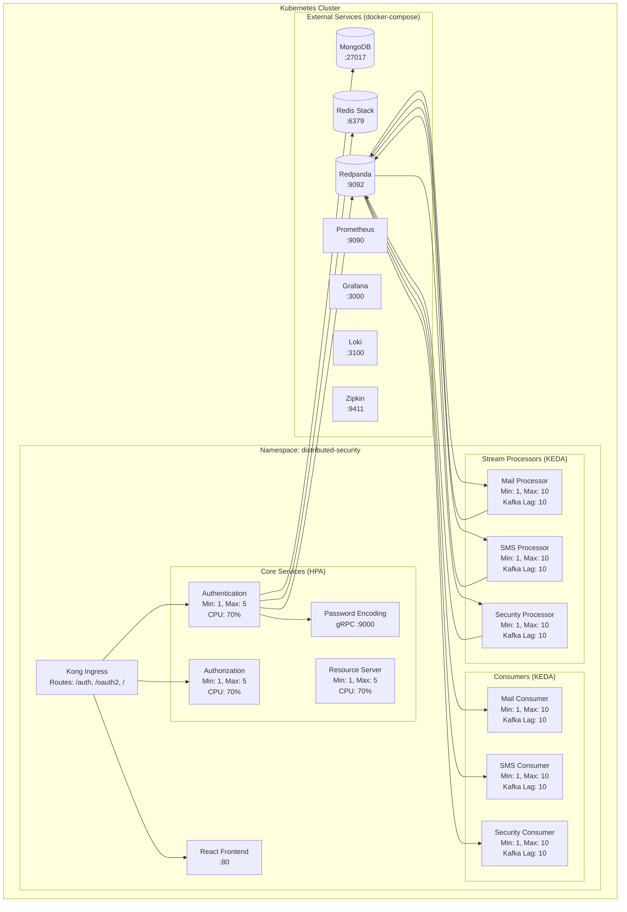

### HPA Configuration

**File:** [`k8s/hpa.yaml`](file:///Users/rahulgupta/Desktop/distributedSecurity/k8s/hpa.yaml)

Autoscales core services based on CPU utilization:

```yaml
apiVersion: autoscaling/v2
kind: HorizontalPodAutoscaler
metadata:
  name: authentication-hpa
  namespace: distributed-security
spec:
  scaleTargetRef:
    apiVersion: apps/v1
    kind: Deployment
    name: authentication
  minReplicas: 1
  maxReplicas: 5
  metrics:
    - type: Resource
      resource:
        name: cpu
        target:
          type: Utilization
          averageUtilization: 70
```

**Services with HPA:**

- Authentication Service (1-5 replicas, 70% CPU)
- Authorization Server (1-5 replicas, 70% CPU)
- Resource Server (1-5 replicas, 70% CPU)

### KEDA Autoscaling

**File:** [`k8s/keda-autoscaling.yaml`](file:///Users/rahulgupta/Desktop/distributedSecurity/k8s/keda-autoscaling.yaml)

Autoscales Kafka consumers based on topic lag:

```yaml
apiVersion: keda.sh/v1alpha1
kind: ScaledObject
metadata:
  name: mail-stream-processor-scaledobject
  namespace: distributed-security
spec:
  scaleTargetRef:
    name: mail-stream-processor
  minReplicaCount: 1
  maxReplicaCount: 10
  triggers:
    - type: kafka
      metadata:
        bootstrapServers: redpanda.default.svc.cluster.local:9092
        consumerGroup: mail-processor-group
        topic: mail-topic
        lagThreshold: "10"
```

**Services with KEDA:**

- Mail Stream Processor (1-10 replicas, lag threshold: 10)
- SMS Stream Processor (1-10 replicas, lag threshold: 10)
- Security Event Processor (1-10 replicas, lag threshold: 10)
- Processed Mail Consumer (1-10 replicas, lag threshold: 10)
- Processed SMS Consumer (1-10 replicas, lag threshold: 10)
- Processed Security Event Consumer (1-10 replicas, lag threshold: 10)

### Kong Ingress

**File:** [`k8s/kong-ingress.yaml`](file:///Users/rahulgupta/Desktop/distributedSecurity/k8s/kong-ingress.yaml)

Routes external traffic to services:

```yaml
apiVersion: networking.k8s.io/v1
kind: Ingress
metadata:
  name: app-ingress
  namespace: distributed-security
  annotations:
    konghq.com/strip-path: "true"
    kubernetes.io/ingress.class: kong
spec:
  rules:
    - http:
        paths:
          - path: /auth
            pathType: Prefix
            backend:
              service:
                name: authentication
                port:
                  number: 10000
          - path: /oauth2
            pathType: Prefix
            backend:
              service:
                name: autherization
                port:
                  number: 12000
          - path: /
            pathType: Prefix
            backend:
              service:
                name: frontend
                port:
                  number: 80
```

### Service Ports

| Service                        | Port  | Protocol | Purpose                |
| ------------------------------ | ----- | -------- | ---------------------- |
| Authentication                 | 10000 | HTTP     | User management, FIDO2 |
| Authorization                  | 12000 | HTTP     | OAuth2/OIDC endpoints  |
| Resource Server                | 10002 | HTTP     | Protected APIs         |
| Password Encoding              | 9000  | gRPC     | Argon2id hashing       |
| Mail Stream Processor          | 10003 | HTTP     | Actuator metrics       |
| SMS Stream Processor           | 10005 | HTTP     | Actuator metrics       |
| Security Event Processor       | 10004 | HTTP     | Actuator metrics       |
| Processed Mail Consumer        | 10006 | HTTP     | Actuator metrics       |
| Processed SMS Consumer         | 10008 | HTTP     | Actuator metrics       |
| Processed Security Event Cons. | 10007 | HTTP     | Actuator metrics       |
| Frontend                       | 80    | HTTP     | React UI               |

### Deployment Commands

```bash
# Create namespace
kubectl apply -f k8s/namespace.yaml

# Deploy ConfigMaps and Secrets
kubectl apply -f k8s/configmap-common.yaml
kubectl apply -f k8s/secrets.yaml

# Deploy all services
kubectl apply -f k8s/authentication.yaml
kubectl apply -f k8s/autherization.yaml
kubectl apply -f k8s/resource-server.yaml
kubectl apply -f k8s/password-encoding.yaml
kubectl apply -f k8s/mail-stream-processor.yaml
kubectl apply -f k8s/sms-stream-processor.yaml
kubectl apply -f k8s/security-event-stream-processor.yaml
kubectl apply -f k8s/processed-mail-consumer.yaml
kubectl apply -f k8s/processed-sms-consumer.yaml
kubectl apply -f k8s/processed-security-event-consumer.yaml
kubectl apply -f k8s/frontend.yaml

# Deploy HPA
kubectl apply -f k8s/hpa.yaml

# Deploy KEDA autoscaling
kubectl apply -f k8s/keda-autoscaling.yaml

# Deploy Kong ingress
kubectl apply -f k8s/kong-ingress.yaml

# Verify deployments
kubectl get pods -n distributed-security
kubectl get hpa -n distributed-security
kubectl get scaledobjects -n distributed-security
```

---

## 📊 Monitoring & Observability

The system implements comprehensive observability using the **Prometheus + Grafana + Loki + Zipkin** stack, with all 11 microservices exposing metrics via Spring Boot Actuator.

### Prometheus Scrape Configuration

**File:** [`prometheus.yml`](file:///Users/rahulgupta/Desktop/distributedSecurity/prometheus.yml)

All services expose metrics at `/actuator/prometheus`:

```yaml
scrape_configs:
  - job_name: "authentication-service"
    metrics_path: "/actuator/prometheus"
    static_configs:
      - targets: ["host.docker.internal:10000"]

  - job_name: "authorization-service"
    metrics_path: "/actuator/prometheus"
    static_configs:
      - targets: ["host.docker.internal:12000"]

  - job_name: "resource-server"
    metrics_path: "/actuator/prometheus"
    static_configs:
      - targets: ["host.docker.internal:10002"]

  - job_name: "password-encoding-service"
    metrics_path: "/actuator/prometheus"
    static_configs:
      - targets: ["host.docker.internal:9000"]

  - job_name: "mail-stream-processor"
    metrics_path: "/actuator/prometheus"
    static_configs:
      - targets: ["host.docker.internal:10003"]

  - job_name: "sms-stream-processor"
    metrics_path: "/actuator/prometheus"
    static_configs:
      - targets: ["host.docker.internal:10005"]

  - job_name: "security-event-stream-processor"
    metrics_path: "/actuator/prometheus"
    static_configs:
      - targets: ["host.docker.internal:10004"]

  - job_name: "processed-mail-consumer"
    metrics_path: "/actuator/prometheus"
    static_configs:
      - targets: ["host.docker.internal:10006"]

  - job_name: "processed-sms-consumer"
    metrics_path: "/actuator/prometheus"
    static_configs:
      - targets: ["host.docker.internal:10008"]

  - job_name: "processed-security-event-consumer"
    metrics_path: "/actuator/prometheus"
    static_configs:
      - targets: ["host.docker.internal:10007"]
```

**Total Services Monitored:** 11 microservices

### Grafana Dashboards

Access Grafana at `http://localhost:3000` (default credentials: `admin/admin`)

**Pre-configured Datasources:**

- Prometheus (metrics)
- Loki (logs)
- Zipkin (traces)

#### Dashboard 1: System Overview & Health

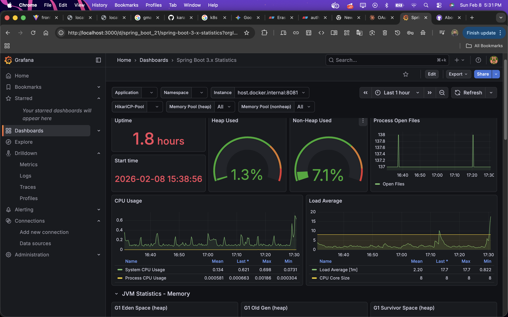
_Real-time monitoring showing uptime (1.8 hours), heap usage (1.3%), non-heap usage (7.1%), CPU usage, load average, and process open files_

#### Dashboard 2: JVM Memory & CodeHeap Metrics

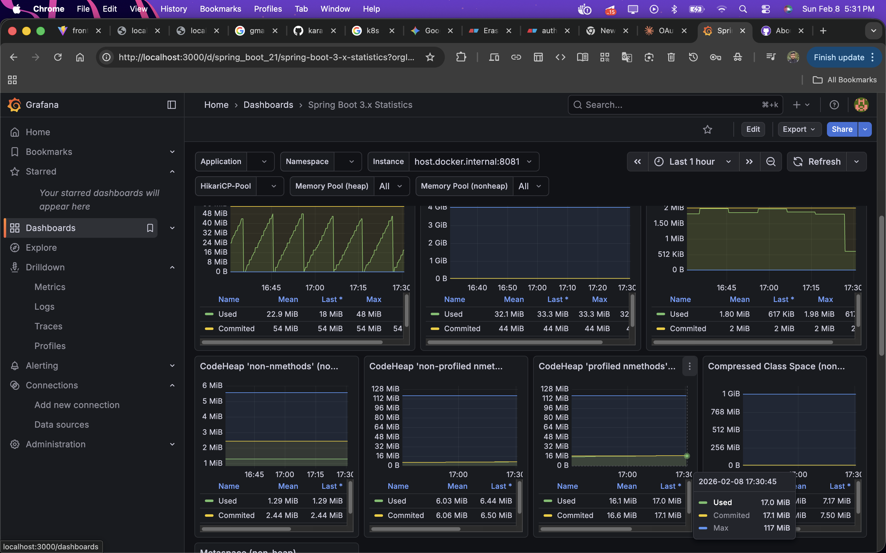
_Detailed JVM statistics including memory pool details, CodeHeap metrics (non-nmethods, non-profiled, profiled), and compressed class space monitoring_

#### Dashboard 3: HTTP Request Metrics

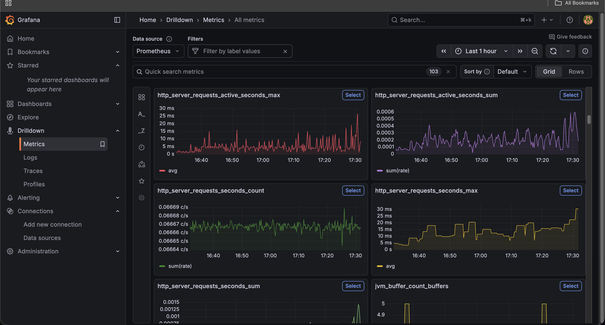
_HTTP server request metrics showing active seconds (max, count, sum), request counts, and JVM buffer metrics_

### Key Metrics

```promql
# HTTP Request Rate
rate(http_server_requests_seconds_count[5m])

# HTTP Request Duration (p95)
histogram_quantile(0.95, http_server_requests_seconds_bucket)

# JVM Memory Usage
jvm_memory_used_bytes{area="heap"}

# Kafka Consumer Lag
kafka_consumer_lag{topic="mail-topic"}

# Active Sessions
redis_sessions_active_total

# Failed Login Attempts
security_events_total{event="LOGIN_FAIL"}

# gRPC Metrics
grpc_server_handled_total{method="HashPassword"}
grpc_server_handling_seconds{method="VerifyPassword"}
```

### Distributed Tracing with Zipkin

**Access:** `http://localhost:9411`

Zipkin captures distributed traces across all microservices with detailed span information:

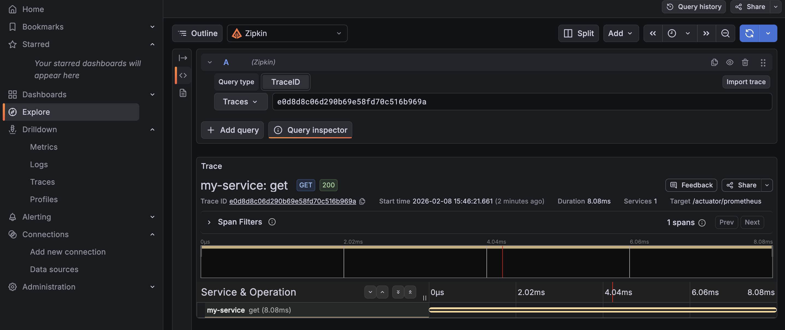
_Example trace showing `my-service: get` operation with 8.04ms duration, including service dependencies and timing breakdown_

**Trace Flow Example:**

```
User Login Request
  ├─ Authentication Service (10ms)
  │   ├─ Password Encoding gRPC (45ms)
  │   ├─ MongoDB Query (5ms)
  │   └─ Redis Session Create (2ms)
  ├─ Authorization Service (8ms)
  │   └─ Token Generation (3ms)
  └─ Kafka Publish (1ms)
      └─ Security Event Processor (12ms)
```

**Spring Boot Configuration:**

```java
management:
  tracing:
    sampling:
      probability: 1.0  // 100% sampling for development
  zipkin:
    tracing:
      endpoint: http://zipkin:9411/api/v2/spans
```

### Centralized Logging with Loki

**Access:** Via Grafana → Explore → Loki

All services send logs to Loki via Logback configuration:

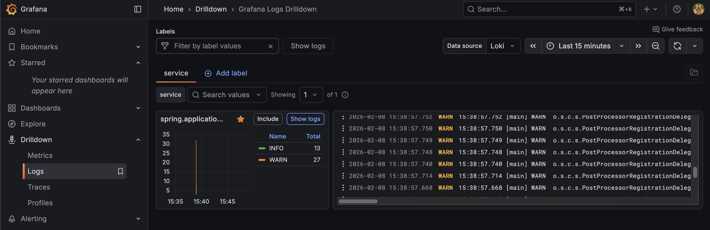
_Grafana Logs Drilldown showing service logs with filtering by service name, including detailed log entries with timestamps and severity levels_

**Logback Configuration:**

```xml
<appender name="LOKI" class="com.github.loki4j.logback.Loki4jAppender">
    <http>
        <url>http://loki:3100/loki/api/v1/push</url>
    </http>
    <format>
        <label>
            <pattern>service=${SERVICE_NAME},env=dev</pattern>
        </label>
    </format>
</appender>
```

**Query Examples:**

```logql
# All logs from authentication service
{service="authentication-service"}

# Failed login attempts
{service="authentication-service"} |= "LOGIN_FAIL"

# Errors across all services
{env="dev"} |= "ERROR"

# Logs from specific time range
{service="mail-stream-processor"} |= "ProcessedMail"
```

### Observability Stack Deployment

**File:** [`docker-compose.yaml`](file:///Users/rahulgupta/Desktop/distributedSecurity/docker-compose.yaml)

```yaml
services:
  # Prometheus for metrics
  prometheus:
    image: prom/prometheus:latest
    ports:
      - "9090:9090"
    volumes:
      - ./prometheus.yml:/etc/prometheus/prometheus.yml

  # Loki for logs
  loki:
    image: grafana/loki:latest
    ports:
      - "3100:3100"

  # Zipkin for distributed tracing
  zipkin:
    image: openzipkin/zipkin
    ports:
      - "9411:9411"

  # Grafana for visualization
  grafana:
    image: grafana/grafana:latest
    ports:
      - "3000:3000"
    environment:
      - GF_SECURITY_ADMIN_PASSWORD=admin
    volumes:
      - ./grafana-datasource.yml:/etc/grafana/provisioning/datasources/datasources.yml
```

**Start Observability Stack:**

```bash
docker-compose up -d prometheus loki zipkin grafana
```

### Alerting (Future Enhancement)

Prometheus Alertmanager can be configured for:

- High error rates
- Service downtime
- Kafka consumer lag exceeding threshold
- Memory/CPU usage alerts
- Failed authentication attempts spike

---

## 🔄 CI/CD Pipeline

The project uses **Jenkins** for continuous integration and deployment, with dedicated Jenkinsfiles for each of the 11 microservices.

### Jenkins Pipeline Structure

**Location:** [`jenkins/`](file:///Users/rahulgupta/Desktop/distributedSecurity/jenkins/)

Each service has its own Jenkinsfile:

- `jenkins/authentication/Jenkinsfile`
- `jenkins/autherization/Jenkinsfile`
- `jenkins/resource-server/Jenkinsfile`
- `jenkins/password-encoding/Jenkinsfile`
- `jenkins/mail-stream-processor/Jenkinsfile`
- `jenkins/sms-stream-processor/Jenkinsfile`
- `jenkins/security-event-stream-processor/Jenkinsfile`
- `jenkins/processed-mail-consumer/Jenkinsfile`
- `jenkins/processed-sms-consumer/Jenkinsfile`
- `jenkins/processed-security-event-consumer/Jenkinsfile`
- `jenkins/frontend/Jenkinsfile`

### Pipeline Stages

```groovy
pipeline {
    agent any

    stages {
        stage('Checkout') {
            steps {
                git branch: 'main', url: 'https://github.com/karankumar786786/distributedSecurity.git'
            }
        }

        stage('Build') {
            steps {
                sh 'mvn clean package -DskipTests'
            }
        }

        stage('Test') {
            steps {
                sh 'mvn test'
            }
        }

        stage('Build Docker Image') {
            steps {
                sh 'docker build -t authentication-service:${BUILD_NUMBER} .'
            }
        }

        stage('Push to Registry') {
            steps {
                sh 'docker push authentication-service:${BUILD_NUMBER}'
            }
        }

        stage('Deploy to Kubernetes') {
            steps {
                sh 'kubectl set image deployment/authentication authentication=authentication-service:${BUILD_NUMBER} -n distributed-security'
            }
        }
    }
}
```

### Deployment Workflow

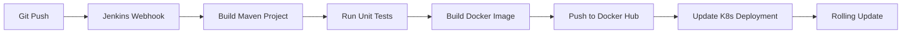

### Automated Deployment Script

**File:** [`update-services.sh`](file:///Users/rahulgupta/Desktop/distributedSecurity/update-services.sh)

```bash
#!/bin/bash
# Update all services in Kubernetes

services=(
    "authentication"
    "autherization"
    "resource-server"
    "password-encoding"
    "mail-stream-processor"
    "sms-stream-processor"
    "security-event-stream-processor"
    "processed-mail-consumer"
    "processed-sms-consumer"
    "processed-security-event-consumer"
    "frontend"
)

for service in "${services[@]}"; do
    echo "Updating $service..."
    kubectl rollout restart deployment/$service -n distributed-security
    kubectl rollout status deployment/$service -n distributed-security
done
```

---

## 📡 API Documentation

The system exposes comprehensive REST APIs for authentication, account management, OAuth2, and key management.

### Authentication Endpoints

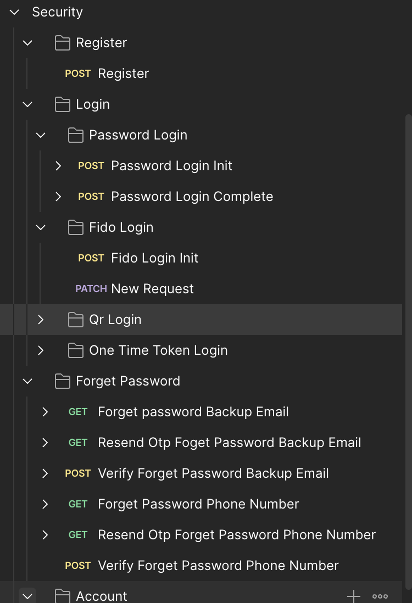

**Available Endpoints:**

- **Register:** `POST /api/auth/register` - User registration
- **Login:**
  - **Password Login Init:** `POST /api/auth/login/password/init` - Initialize password-based login
  - **Password Login Complete:** `POST /api/auth/login/password/complete` - Complete password authentication
  - **FIDO Login Init:** `POST /api/auth/login/fido/init` - Initialize FIDO2/WebAuthn login
  - **FIDO Login:** `PATCH /api/auth/login/fido` - New FIDO request
  - **QR Login:** QR code-based authentication
  - **One Time Token Login:** Single-use token authentication
- **Forget Password:**
  - `GET /api/auth/forget-password/backup-email` - Request password reset via backup email
  - `GET /api/auth/forget-password/backup-email/resend-otp` - Resend OTP to backup email
  - `POST /api/auth/forget-password/backup-email/verify` - Verify backup email OTP
  - `GET /api/auth/forget-password/phone-number` - Request password reset via phone
  - `GET /api/auth/forget-password/phone-number/resend-otp` - Resend OTP to phone
  - `POST /api/auth/forget-password/phone-number/verify` - Verify phone OTP

### Account Management Endpoints

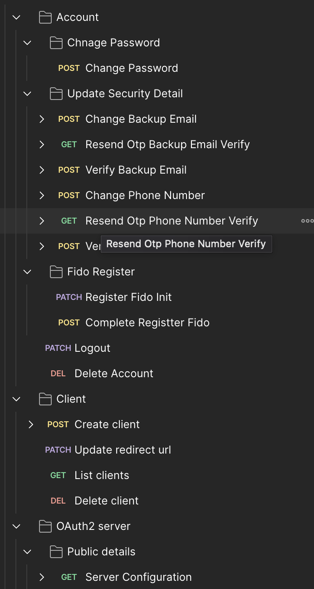

**Available Endpoints:**

- **Change Password:** `POST /api/account/change-password` - Update user password
- **Update Security Details:**
  - `POST /api/account/security/backup-email` - Change backup email
  - `GET /api/account/security/backup-email/resend-otp` - Resend backup email verification OTP
  - `POST /api/account/security/backup-email/verify` - Verify backup email
  - `POST /api/account/security/phone-number` - Change phone number
  - `GET /api/account/security/phone-number/resend-otp` - Resend phone verification OTP
  - `POST /api/account/security/phone-number/verify` - Verify phone number
- **FIDO Register:**
  - `PATCH /api/account/fido/register/init` - Initialize FIDO2 registration
  - `POST /api/account/fido/register/complete` - Complete FIDO2 registration
- **Account Actions:**
  - `PATCH /api/account/logout` - User logout
  - `DEL /api/account/delete` - Delete user account
- **OAuth2 Client Management:**
  - `POST /api/client/create` - Create new OAuth2 client
  - `PATCH /api/client/redirect-uri` - Update client redirect URI
  - `GET /api/client/list` - List all clients
  - `DEL /api/client/delete` - Delete OAuth2 client

### OAuth2 Server Endpoints

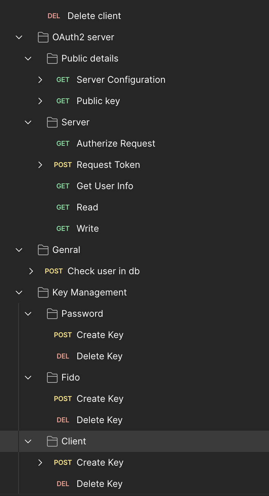

**Available Endpoints:**

- **Public Details:**
  - `GET /oauth2/server-configuration` - Server configuration
  - `GET /oauth2/public-key` - Public key for token verification
- **Authorization:**
  - `GET /oauth2/authorize` - Authorization request
  - `POST /oauth2/token` - Token request
  - `GET /oauth2/user-info` - Get user information
  - `GET /oauth2/read` - Read scope
  - `GET /oauth2/write` - Write scope
- **General:**
  - `POST /oauth2/check-user-in-db` - Check if user exists
- **Key Management:**
  - **Password Keys:**
    - `POST /oauth2/keys/password/create` - Create password HMAC key
    - `DEL /oauth2/keys/password/delete` - Delete password key
  - **FIDO Keys:**
    - `POST /oauth2/keys/fido/create` - Create FIDO HMAC key
    - `DEL /oauth2/keys/fido/delete` - Delete FIDO key
  - **Client Keys:**
    - `POST /oauth2/keys/client/create` - Create client key
    - `DEL /oauth2/keys/client/delete` - Delete client key

### Password Encoding Service (gRPC)

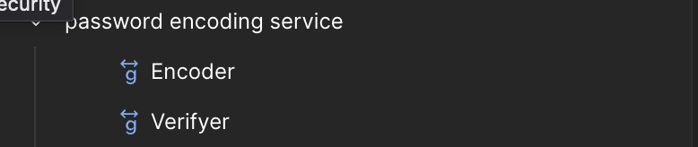

**Available gRPC Methods:**

- **Encoder:** `HashPassword(PasswordRequest) → PasswordResponse` - Hash password using Argon2id
- **Verifier:** `VerifyPassword(VerifyRequest) → VerifyResponse` - Verify password against hash

**Protocol Definition:**

```protobuf
service PasswordHasher {
  rpc HashPassword(HashPasswordRequest) returns (HashPasswordResponse);
  rpc VerifyPassword(VerifyPasswordRequest) returns (VerifyPasswordResponse);
}
```

---

## Security Best Practices

## 🔐 Security Best Practices

### 1. Never Store Plaintext Secrets

❌ **Bad:**

```java
private static final String VAULT_TOKEN = "s.1234567890abcdef";
```

✅ **Good:**

```java
@Value("${vault.token}")
private String vaultToken;  // From Kubernetes secret

// Or use Vault Kubernetes auth
VaultTemplate vaultTemplate = new VaultTemplate(
    VaultEndpoint.from(vaultUri),
    new KubernetesAuthentication(
        "oauth2-service",  // Service account
        Paths.get("/var/run/secrets/kubernetes.io/serviceaccount/token")
    )
);
```

### 2. Rotate All Secrets Regularly

```bash
# Automated rotation with Vault
vault write auth/kubernetes/role/oauth2-service \
    bound_service_account_names=oauth2-service \
    bound_service_account_namespaces=default \
    policies=oauth2-policy \
    ttl=1h \
    max_ttl=24h

# Keys auto-rotate every 30 days
vault write transit/keys/oauth2-jwt-signing/rotate
```

### 3. Principle of Least Privilege

```yaml
# Kubernetes RBAC for OAuth2 service
apiVersion: rbac.authorization.k8s.io/v1
kind: Role
metadata:
  name: oauth2-service-role
rules:
  - apiGroups: [""]
    resources: ["secrets"]
    resourceNames: ["oauth2-config"] # Only specific secret
    verbs: ["get"]
---
apiVersion: rbac.authorization.k8s.io/v1
kind: RoleBinding
metadata:
  name: oauth2-service-binding
subjects:
  - kind: ServiceAccount
    name: oauth2-service
roleRef:
  kind: Role
  name: oauth2-service-role
  apiGroup: rbac.authorization.k8s.io
```

### 4. Network Segmentation

```yaml
# Istio AuthorizationPolicy - Only allow specific services
apiVersion: security.istio.io/v1beta1
kind: AuthorizationPolicy
metadata:
  name: oauth2-access-control
spec:
  selector:
    matchLabels:
      app: oauth2-service
  action: ALLOW
  rules:
    - from:
        - source:
            principals: ["cluster.local/ns/default/sa/ingress-gateway"]
      to:
        - operation:
            methods: ["GET", "POST"]
            paths: ["/oauth2/*", "/api/webauthn/*"]

    - from:
        - source:
            principals: ["cluster.local/ns/default/sa/password-hasher"]
      to:
        - operation:
            methods: ["POST"]
            paths: ["/internal/verify-integrity"]
```

### 5. Audit Everything

```java
// Audit interceptor for all security events
@Component
public class SecurityAuditInterceptor implements HandlerInterceptor {

    @Autowired
    private KafkaTemplate<String, SecurityEvent> kafkaTemplate;

    @Override
    public void afterCompletion(HttpServletRequest request,
                                HttpServletResponse response,
                                Object handler, Exception ex) {

        SecurityEvent event = SecurityEvent.builder()
            .user(getCurrentUserId())
            .event(determineEvent(request, response))
            .ipAddress(request.getRemoteAddr())
            .deviceHash(generateDeviceHash(request))
            .build();

        kafkaTemplate.send("security-events", event);
    }
}
```

---

## ⚡ Performance Tuning

### ScyllaDB Tuning

```cql
-- Enable bloom filter cache for faster lookups
ALTER TABLE access_tokens WITH bloom_filter_fp_chance = 0.01;

-- Tune compaction strategy
ALTER TABLE access_tokens WITH compaction = {
  'class': 'TimeWindowCompactionStrategy',
  'compaction_window_unit': 'HOURS',
  'compaction_window_size': 1
};

-- Set proper caching
ALTER TABLE access_tokens WITH caching = {
  'keys': 'ALL',
  'rows_per_partition': '100'
};
```

### Dragonfly Optimization

```yaml
# dragonfly.conf
maxmemory 8gb
maxmemory-policy allkeys-lru
save ""  # Disable persistence (session cache only)
appendonly no

# Enable pipelining for bulk operations
tcp-nodelay yes
tcp-backlog 511
```

### JVM Tuning

```bash
# OAuth2 service JVM flags
JAVA_OPTS="-Xms2g -Xmx4g \
  -XX:+UseG1GC \
  -XX:MaxGCPauseMillis=200 \
  -XX:+ParallelRefProcEnabled \
  -XX:+HeapDumpOnOutOfMemoryError \
  -XX:HeapDumpPath=/tmp/heapdump.hprof \
  -Dcom.sun.management.jmxremote \
  -Dcom.sun.management.jmxremote.port=9010 \
  -Dcom.sun.management.jmxremote.authenticate=false \
  -Dcom.sun.management.jmxremote.ssl=false"
```

### Istio Performance

```yaml
# Reduce latency with connection pooling
apiVersion: networking.istio.io/v1beta1
kind: DestinationRule
metadata:
  name: oauth2-performance
spec:
  host: oauth2-service
  trafficPolicy:
    connectionPool:
      tcp:
        maxConnections: 1000
        connectTimeout: 30ms
        tcpKeepalive:
          time: 7200s
          interval: 75s
      http:
        http2MaxRequests: 1000
        maxRequestsPerConnection: 10
        h2UpgradePolicy: UPGRADE
    loadBalancer:
      simple: LEAST_REQUEST # Better than ROUND_ROBIN
```

---

## 🤝 Contributing

Contributions are welcome! This is a college project, but we encourage:

- Bug reports and fixes
- Performance improvements
- Documentation enhancements
- Security vulnerability reports

### Development Workflow

```bash
# 1. Fork and clone
git clone https://github.com/YOUR_USERNAME/distributedSecurity.git
cd distributedSecurity

# 2. Create feature branch
git checkout -b feature/add-oauth2-device-flow

# 3. Make changes and test
./mvnw clean test
./mvnw verify

# 4. Run code quality checks
./mvnw sonar:sonar

# 5. Submit PR
git push origin feature/add-oauth2-device-flow
```

### Code Style

- Java: Google Java Style Guide
- Kotlin: Official Kotlin style guide
- Use `./mvnw spotless:apply` to format code

---

## 📄 License

This project is licensed under the MIT License - see the [LICENSE](LICENSE) file for details.

---

## 🙏 Acknowledgments

- **Spring Security OAuth2** - Core authorization server framework
- **Yubico WebAuthn Java** - FIDO2/WebAuthn implementation
- **HashiCorp Vault** - Secrets management inspiration
- **ScyllaDB** - High-performance NoSQL database
- **Istio Community** - Service mesh best practices
- **Anthropic Claude** - README generation assistance 😊

---

## 📞 Contact

**Author:** Karan Kumar  
**GitHub:** [karankumar786786](https://github.com/karankumar786786)  
**Project Link:** [https://github.com/karankumar786786/distributedSecurity](https://github.com/karankumar786786/distributedSecurity)

---

## 🎓 Academic Note

This project was developed as a college project to demonstrate:

- Enterprise software architecture patterns
- OAuth2/OIDC implementation
- Cloud-native application design
- Security engineering principles
- DevOps and SRE practices

**Educational Objectives Met:**

- ✅ Distributed systems design
- ✅ Cryptographic protocol implementation
- ✅ Infrastructure as Code
- ✅ Observability and monitoring
- ✅ Security threat modeling

---

<div align="center">

**⭐ If this project helped you learn, please consider giving it a star! ⭐**

Made with ❤️ by [Karan Kumar](https://github.com/karankumar786786)

</div>
